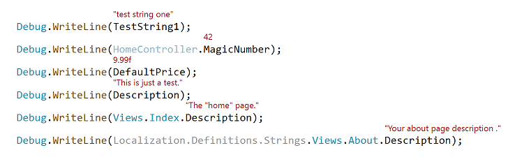

# ConstVisualizer

Download the extension from the [VS Marketplace](https://marketplace.visualstudio.com/items?itemName=MattLaceyLtd.ConstVisualizer)

-------------------------------------

A Visual Studio extension to show the values of constants where they are used in C# & VB.Net code.

Please [raise issues to report bugs, features, suggestions, etc.](https://github.com/mrlacey/ConstVisualizer/issues/new)

If you like this, you'll probably also enjoy the [String Resource Visualizer](https://marketplace.visualstudio.com/items?itemName=MattLaceyLtd.StringResourceVisualizer) too.
